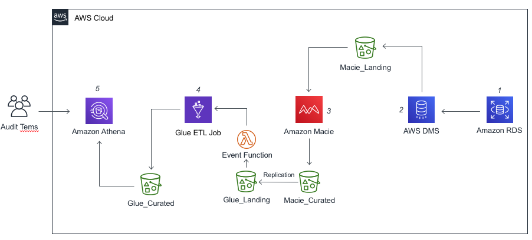

## Data Discovery and Classification of RDS Database in AWS

### Overview

Amazon Macie is a fully managed data security and data privacy service that uses machine learning and pattern matching to discover and protect your sensitive data in AWS.
Today it's only possible to run Amazon Macie Jobs against S3 buckets, so this solution will shows how to discover and classify relational database data from RDS using AWS Database Migration
and also will use Amazon Athena and Amazon QuickSight to simplify the audit assessments on Amazon Macie Jobs results.



As you see, the architecture from the solution that we will show you how to build is described as:

1.	Classic Models demo relational database on RDS for MySQL.
2.	DMS task that connect to Classic Models Demo database and transform the data into a several CSV files and load into S3 bucket.
3.	Once the DMS task has being succeed, the Amazon Macie classification job will start to discover and classified the data and put the results into other S3 bucket. 
4.	Once the classification job results are delivered, Amazon Athena will use Hive to create a table from the job classification results bucket.
5.	Amazon Quicksight will be used to create a data source and start to create audit dashboards.


To get started you will need an IAM user with the following access:

- Amazon Macie
- AWS CloudFormation
- AWS Cloud9
- Amazon RDS
- Amazon Athena
- Amazon S3
- Amazon QuickSight

_Note: Tested in the N. Virginia region (us-east-1)._

### Agenda
1. Enable Amazon Macie - 5 mins
2. Run the initial cloudformation template - 10 mins
3. Configure Macie to export findings to an S3 Bucket - 5 mins
4. Load the sample database into RDS - 1 min
4. Create a classification job to scan all database exported- 10 mins

## Enable Amazon Macie
Your first step is to enable Amazon Macie.  Later we will create data classification jobs to investigate the contents of your S3 buckets and Macie will also do analysis on your S3 buckets and report on any configuration changes.

1. Go to the [Amazon Macie](https://console.aws.amazon.com/macie/home?region=us-east-1) console (us-east-1).
2. Click on the **Get Started** button.
3. Click on the **Enable Macie** button.  If not present then Macie is already enabled.
 
Macie is now enabled and has begun to collect information about the S3 buckets in the account.

## CloudFormation
1. Download the deploy/template.yaml file in your computer
2. Open the [CloudFormation](https://console.aws.amazon.com/cloudformation/home?region=us-east-1) console (us-east-1).
3. On the Welcome page, click on **Create stack** button.
4. On the Step 1 - Specify template: Choose Upload a template file, click on **Choose file** button and select the **template.yaml**.
5. On the Step 2 - Specify stack details: Enter the Stack name as **RDS2MacieDemo** and define your MySQL admin password on **DBPassword**.
6. On the Step 3 - Configure stack options: Just click on **Next** button.
7. On the Step 4 - Review: Enable the checkbox **I acknowledge that AWS CloudFormation might create IAM resources with custom names.**, and click on **Create Stack** button.
8. Wait for the stack get into status **CREATE_COMPLETE**.

_Note: Under the Outputs tab, take a note of **EndpointAddress** and **EndpointPort** value_
  

## Using Cloud9 environment
1. Open the [Cloud9](https://console.aws.amazon.com/cloud9/home?region=us-east-1) console (us-east-1).
2. In **Your environments**, click in the **Open IDE** button on the envionment that CloudFormation created (eg. RDS2MacieDemo-environment.
2. Once your envionment was open, select the **bash** tab and execute the following commands:

```
git clone https://github.com/brunormsilveira/rds-dataclassification-macie.git

```

## Deploying ClassicModels Database 

1. Once with the code in your envionment, enter into repository folder.

```
cd rds-dataclassification-macie/
```

2. Now let's load the data from classicmodels database into RDS instance.

```
mysql -u admin -h [ENDPOINT-FROM-RDS-INSTANCE] classicmodels -p < deploy/classicmodels.sql

```
_Note: when ask you the password from MySQL, use the password that you defined on **DBPassword** paramenter in the CloudFormation template._

## Runing DMS Task

1. Open the [DMS](https://console.aws.amazon.com/dms/v2/home?region=us-east-1#dashboard) console (us-east-1).
2. In the DMS Dashboard, click on **Database migration tasks**.
3. You will see a task with name initiating with **rdstos3task-**. Select it.
4. Click on **Actions** and choose **Restart/Resume**.

```
CREATE EXTERNAL TABLE `macie_results2`(
  `schemaversion` string COMMENT 'from deserializer', 
  `id` string COMMENT 'from deserializer', 
  `accountid` string COMMENT 'from deserializer', 
  `partition` string COMMENT 'from deserializer', 
  `region` string COMMENT 'from deserializer', 
  `type` string COMMENT 'from deserializer', 
  `title` string COMMENT 'from deserializer', 
  `description` string COMMENT 'from deserializer', 
  `severity` struct<score:string,description:string> COMMENT 'from deserializer', 
  `createdat` string COMMENT 'from deserializer', 
  `resourcesaffected` struct<s3bucket:struct<arn:string,name:string,createdat:string,owner:struct<displayname:string,id:string>>> COMMENT 'from deserializer', 
  `encryptiontype` string COMMENT 'from deserializer', 
  `publicaccess` struct<permissionconfiguration:struct<bucketlevelpermissions:struct<accesscontrollist:struct<allowspublicreadaccess:string,allowspublicwriteaccess:string>,bucketpolicy:struct<allowspublicreadaccess:string,allowspublicwriteaccess:string>,blockpublicaccess:struct<ignorepublicacls:string,restrictpublicbuckets:string,blockpublicacls:string,blockpublicpolicy:string>>,accountlevelpermissions:struct<blockpublicaccess:struct<ignorepublicacls:string,restrictpublicbuckets:string,blockpublicacls:string,blockpublicpolicy:string>>>,effectivepermission:string> COMMENT 'from deserializer', 
  `s3object` struct<bucketarn:string,key:string,path:string,extension:string,lastmodified:string,etag:string,serversideencryption:struct<encryptiontype:string>,size:string,storageclass:string,publicaccess:string> COMMENT 'from deserializer', 
  `category` string COMMENT 'from deserializer')
ROW FORMAT SERDE 
  'org.openx.data.jsonserde.JsonSerDe' 
STORED AS INPUTFORMAT 
  'org.apache.hadoop.mapred.TextInputFormat' 
OUTPUTFORMAT 
  'org.apache.hadoop.hive.ql.io.HiveIgnoreKeyTextOutputFormat'
LOCATION
  's3://[S3Bucket-URL/AWSLogs/[AWS-ACCOUNT-ID]'

```


## Create the first Data Classification Job

Now we are going to create a Data Classification job so we can evaluate the contents of our S3 buckets.  The first job we create will run once a day and evaluate the complete contents of our S3 buckets to make sure we have correctly tagged and classified all our data.  This job will use only the managed identifiers available with Amazon Macie, the complete list of managed identifiers is available [here](https://docs.aws.amazon.com/macie/latest/user/managed-data-identifiers.html).

1. Go to the [Macie console](https://console.aws.amazon.com/macie/home?region=us-east-1).
2. To begin, select the **S3 buckets** option in the left hand menu.
3. Select the three S3 buckets labeled.  You may need to wait a minute and then click ***Refresh icon*** if all the buckets names do not display.
- macieworkshop-env-setup-publicbucket-\<random\>
- macieworkshop-env-setup-internalbucket-\<random\>
- macieworkshop-env-setup-confidentialbucket-\<random\>

4. Click on the **Create job** button. 
> You are now able to verify the S3 buckets you chose before you continue, use the **Previous** or **Remove** buttons if you selected the incorrect S3 buckets.  
5. Click on **Next** to continue.
6. You will now scope your job. Create your job with the following parameters or scope.
- Schedule: Daily  
- Sampling Depth: 100%  
- Leave all other settings as default 
7. Click on **Next** to continue.
> We will not be including any custom data identifiers in this job.
8. Click on **Next** to continue.
9. Give the job a name and description.  

Name|Description
------|-----
**Macie Workshop Scan all buckets**|**Scan all our S3 buckets to discover data using only AWS managed data identifiers**    

10. Click on **Next** to continue.
11. Verify all the details of the job you have created and click on **Submit** to continue.
12. You will see a green banner telling you the ***Job was created successfully***.


## Clean up
1. Delete the solution stack in the following order: Disable Amazon Macie
2. Open the CloudFormation console at https://console.aws.amazon.com/cloudformation
3. Select **RDS2MacieDemo** Stack and click on **Delete** button


## Reference links


## License summary
This sample code is made available under the MIT-0 license. See the LICENSE file.